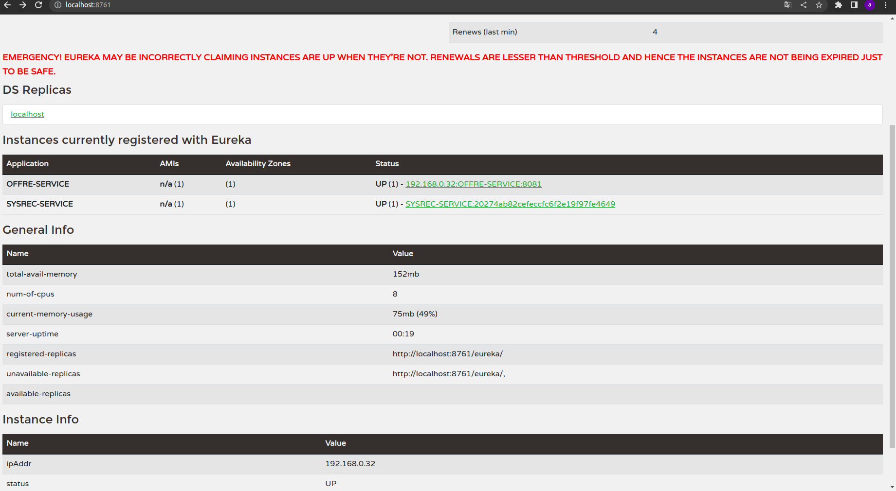

# AZ JOB Java Spring-Boot Microservices 
Le travail qui a été fourni a été effectué dans le cadre du projet IWA (Ingénierie des Application Web) à Polytech Montpellier.
A-Z JOB est une application Web conçue en plusieurs microservices en Spring Boot niveau back-end avec une base de données Postgres. 
---
### Version communes  aux différents repositories
  - Gradle 7.4.2
  - Spring Boot version: 3.0.0

### [Services Registry](link)
- Dependencies:
  - spring-cloud-starter-netflix-eureka-server
	- spring-boot-starter-test'
---
### [API Gateway]()
- Dependencies:
  - spring-cloud-starter-gateway  
  - spring-cloud-starter-netflix-eureka-client
  - spring-cloud-starter-config
  - spring-boot-starter-webflux
---
### [Config]()
- GitHub repository -> application.yml 
- Dependencies:
  - spring-kafka
  - spring-cloud-starter-netflix-eureka-client
- Zookeeper 
- Kafka
---

### Les Microservices
- [Offre](offre), [User](user), [SysRec](sys-rec) Services
- Dependencies:
  - spring-cloud-starter-config
  - spring-cloud-starter-netflix-eureka-client
  - spring-boot-starter-security
  - com.h2database.h2
  - org.projectlombok.lombok
  - spring-boot-starter-data-jpa
  - spring-boot-starter-web 
  - spring-boot-starter-data-rest
---

### [Docker Compose]()
Launch all service
```shell
$ docker-compose -f docker-compose.yml up -d
```

Project Links: 
- Eureka : http://service-registry:8761/
- Offre GET http://localhost:8081/offre/liste
- Offre POST http://localhost:8081/offre/save
  - Content-Type: application/json
    {
    "title": "postmannn",
    "description": "create",
    "skills": "post,man",
    "places": 3,
    "date": "22-10-2022",
    "lieu": "lieee",
    "identreprise": 2
    }
- Offre PUT http://localhost:8081/offre/liste/1
  Content-Type: application/json
  {
  "title": "update",
  "description": "update",
  "skills": "pdifié",
  "places": 3,
  "date": "22-10-2022",
  "lieu": "lieee",
  "identreprise": 2,
  "idEntreprise": 2
  }
- Offre DELETE http://localhost:8081/offre/liste/delete/4
- Candidature POST http://localhost:8081/candidature/save
  Content-Type: application/json
  {
  "idoffre": 2,
  "iduser": 1,
  "status": "ENVOYÉ"
  }
- Candidature PUT http://localhost:8081/candidature/liste/update/1
  Content-Type: application/json 
  {
  "idoffre": 2,
  "iduser": 1,
  "status": "CONSULTÉ"
  }
- Candidature GET http://localhost:8081/candidature/liste/1
- Candidature DELETE http://localhost:8081/candidature/liste/delete/1

- SysRec POST http://localhost:8082/recommandation/save
  Content-Type: application/json 
  {
  "iduser": 1,
  "idoffre": 3
  }


## Run docker-compose
```shell
$ docker-compose -f docker-compose.yml up -d
```

## Stop docker-compose
```shell
$ docker-compose -f docker-compose.yml down
```

### Screenshots



### References:

- https://spring.io/microservices
- https://microservices.io/patterns/microservices.html
- https://www.infoq.com/articles/spring-boot-tutorial/
- https://spring.io/blog/2015/07/14/microservices-with-spring
- https://sofienebk.medium.com/building-microservices-with-spring-boot-753be739ca7d
- https://blog.scottlogic.com/2019/10/31/building-microservices-with-spring-boot.html
- https://www.javatpoint.com/microservices
